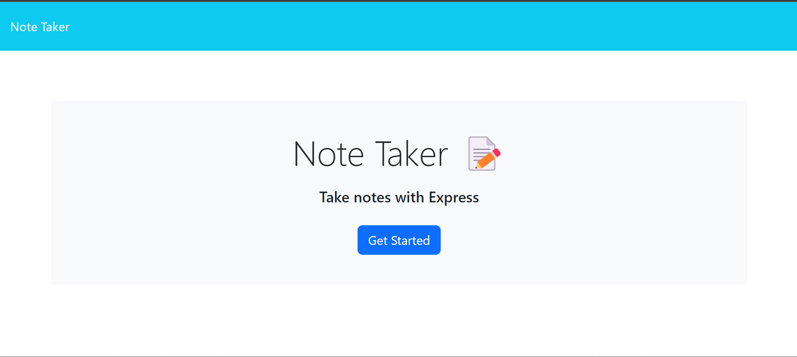
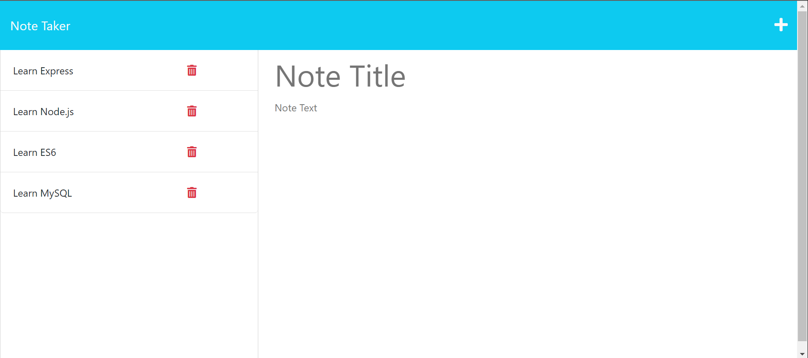
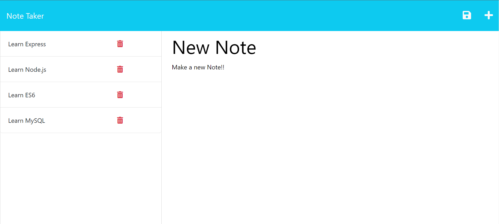
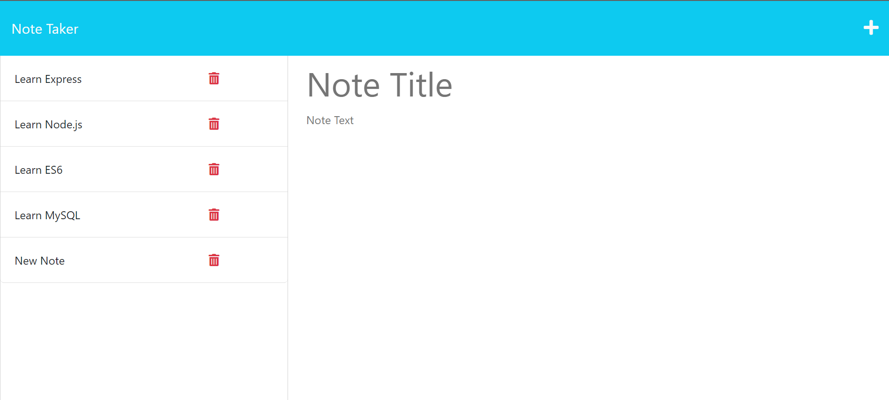
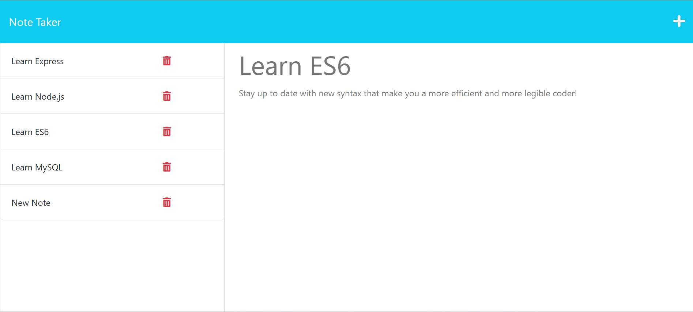
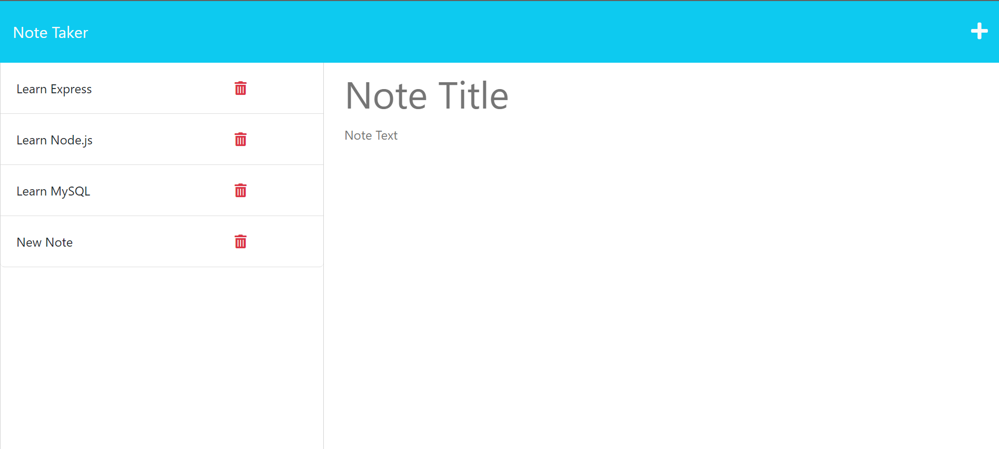

# Note Taker

## Description

- I create this app to store notes on a database and host on a live server so I can access them from anywhere on any machine.
- This allowed me to practice express development using GET, POST and DELETE requests/responses
- This intorduced the concepts of databases and how to make persistant data that can be accessed off of the local machine the app is being run on
- I was able to utilize modular routing to increase code legibility and make future development easier
- I was able to learn basics of utilizing the req.params property to create the delete function

## Table of Contents

- [Usage](#usage)
- [Credits](#credits)

## Usage

This application is deployed at:

[Heroku note app](https://note-taker-95478.herokuapp.com/)

To use this app:

- Click the get started button to open the notes page

- To enter a new note type a title and text into their respective fields then click the save icon that appears in the upper right hand corner

- To view an existing note, click on the note in the left hand column and it will appear in the right hand column in a view only format

- At any time you can click the plus icon in the upper left hand corner and it will reset the input fields allowing you to enter a new note

- To delete a note simply click the red trash icon next to an existing note to delete it.

## Credits

Project created by [Andrew Muhn](https://github.com/andrewmuhn)
as part of UofO Edx Bootcamp

Utilized:

- [node.js](https://nodejs.org/en/about)
- [Express](https://expressjs.com/)
- [UUID](https://www.npmjs.com/package/uuid)
- [Heroku](https://www.heroku.com/)
